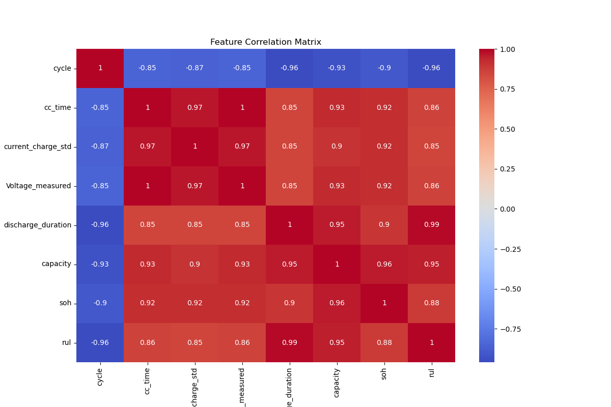
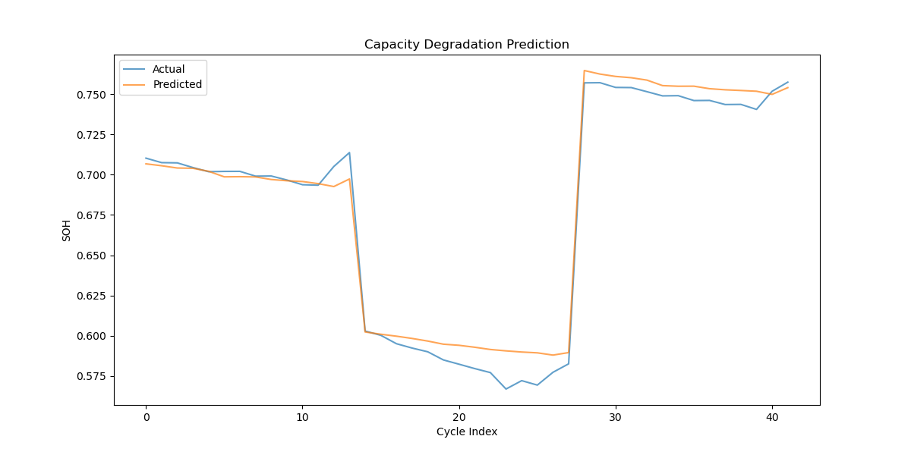

## 1. 数据集介绍

数据集来源于[https://ti.arc.nasa.gov/tech/dash/groups/pcoe/prognostic-data-repository/#battery](https://ti.arc.nasa.gov/tech/dash/groups/pcoe/prognostic-data-repository/#battery)

**数据说明：**
一组四个锂离子电池（#5、6、7和18）在室温下经历了3种不同的操作模式（充电、放电和阻抗）。以1.5A的恒流（CC）模式充电，直到电池电压达到4.2V，然后以恒压（CV）模式继续充电，直到充电电流降至20mA。以2A的恒定电流（CC）水平进行放电，直到电池5、6、7和18的电池电压分别降至2.7V、2.5V、2.2V和2.5V。通过电化学阻抗谱（EIS）从0.1Hz到5kHz的频率扫描进行阻抗测量。重复的充电和放电循环导致电池加速老化，而阻抗测量则提供了对随着老化过程而变化的内部电池参数的洞察。当电池达到寿命终止（EOL）标准时，实验停止，即额定容量下降30%（从2Ahr降至1.4Ahr）。该数据集可用于预测剩余电荷（对于给定的放电循环）和剩余使用寿命（RUL）。
**文件夹：**
B0005.mat 5号电池数据
B0006.mat 6号电池数据
B0007.mat 7号电池数据
B0018.18号电池的最大数据

**数据结构：**

- cycle：包含充电、放电和阻抗操作的顶层结构阵列
- type：充电、放电或阻抗(charge, discharge or impedance)
- ambient_temperature：环境温度（摄氏度）
- time：周期开始的日期和时间，采用MATLAB日期向量格式
- data：包含测量值的数据结构
    - charge充电类型字段为：
        - Voltage_measured：蓄电池端子电压（伏特）
        - Current_measured：电池输出电流（安培）
        - Temperature_measured：电池温度（摄氏度）
        - Current_charge：在充电器处测量的电流（安培）
        - Voltage_charge：在充电器处测量的电压（伏特）
        - Time：周期的时间矢量（秒）
    - discharge放电类型字段为：
        - Voltage_measured：蓄电池端子电压（伏特）
        - Current_measured：电池输出电流（安培）
        - Temperature_measured：电池温度（摄氏度）
        - Current_charge：负载下测量的电流（安培）
        - Voltage_charge：负载下测量的电压（伏特）
        - Time：周期的时间矢量（秒）
        - Capacity：放电至2.7V的电池容量（Ahr）
    - impedance阻抗类型字段为：
        - Sense_current：感测支路中的电流（安培）
        - Battery_current：电池支路中的电流（安培）
        - Current_ratio：上述电流的比率
        - Battery_impedance：根据原始数据计算的电池阻抗（欧姆）
        - Rectified_impedance：校准和平滑的电池阻抗（欧姆）
        - Re：估计电解质电阻（欧姆）
        - Rct：估计的电荷转移电阻（欧姆）

## 2. 数据预处理

考虑阻抗测试数据并不是与充放电周期进行，因此，我们只考虑充放电周期数据,并将相邻的充放电周期数据合并作为一组数据。
```python
# 划分数据集为训练集和测试集
def create_hybrid_split(df, div_batt, div_name, test_ratio=0.2, test_new_batt=None): 
    '''划分数据集为训练集和测试集 
    df: 数据集
    div_batt: 电池ID列表'
    div_name: 按照该属性值划分
    test_ratio: 测试集比例（充放电周期数据前一部分为训练集，后面为测试集，保证无交叉）
    test_new_batt: 新的一组电池作为测试集（可选）
    ''' 
    final_test_batt = test_new_batt
    final_test_df = df[df[div_name] == final_test_batt]

    # 其他电池内部按时间划分
    train_dfs, val_dfs = [], []
    for batt_id in div_batt:
        batt_data = df[df[div_name] == batt_id]
        split_idx = int(len(batt_data) * (1 - test_ratio))

        train_part = batt_data.iloc[:split_idx]
        val_part = batt_data.iloc[split_idx:]

        train_dfs.append(train_part)
        val_dfs.append(val_part)

    return pd.concat(train_dfs), pd.concat(val_dfs), final_test_df


# 开始数据集的划分
all_data = []
for batt_id in ['05', '06', '07', '18']:  # 遍历电池数据B005.mat, B006.mat, B007.mat, B0018.mat
    print(f"Processing battery {batt_id}...")
    cycles = load_battery_data(batt_id)  # 数据加载
    current_cycle_num = 0  # 独立维护每个电池的周期计数器
    last_charge_features = {}  # 存储最近一次充电特征
    initial_capacity = None
    for cycle in cycles:
        # 跳过阻抗测试
        if cycle['type'] == 'impedance':
            continue
        # 提取基础特征
        features = extract_operation_features(cycle)

        if cycle['type'] == 'charge':
            # 缓存充电特征，等待后续放电配对
            last_charge_features = features

        elif cycle['type'] == 'discharge' and last_charge_features != {}: #开始为放电则跳过，确保构建（充电-放电）周期
            if not last_charge_features:
                print(f"Warning: 放电周期 {current_cycle_num} 缺少充电数据")
                continue
            # 合并特征
            full_features = {
                'battery_id': batt_id,
                'cycle': current_cycle_num,
                **last_charge_features,
                **features
            }
            # 初始化容量记录
            if initial_capacity is None:
                initial_capacity = full_features['capacity']
                print(f"电池 {batt_id} 初始容量: {initial_capacity:.2f}Ah")
            # 计算健康指标
            full_features['soh'] = full_features['capacity'] / initial_capacity
            all_data.append(full_features)
            # 周期计数器递增
            current_cycle_num += 1
            last_charge_features = {}  # 重置缓存
# 转换为DataFrame
df = pd.DataFrame(all_data)
```
**数据集划分：**
```python
df = create_dataset()

# 定义特征列（根据最新特征工程调整）
feature_cols = [
    'cc_time',
    'current_charge_std',
    'Voltage_measured',
    'discharge_duration',
    'capacity'
]
# 读取config.yaml定义的目标列
target_col = config['data']['target_col']
# 按电池ID划分数据集（严格隔离）
train_batt_ids = ['05', '06', '07']  # 划分训练集、测试集数据
# test_batt_ids = '18'  # 测试完整新电池数据（可选）

train_df, test_df, final_test_df = create_hybrid_split(df,
                                                        div_batt=train_batt_ids,
                                                        div_name='battery_id',
                                                        test_ratio=config['data']['test_ratio'],
                                                        # test_new_batt=test_batt_ids
                                                        )

# test_df = final_test_df
# 特征标准化（仅在训练数据上拟合）
scaler = StandardScaler()
train_df[feature_cols] = scaler.fit_transform(train_df[feature_cols])
test_df[feature_cols] = scaler.transform(test_df[feature_cols])
```
实验发现，将数据的前一部分用于训练，后一部分用于测试，预测精度高一些。如果采用一组新的电池如B0018号则效果会略微下降，这可能是数据量还是太少的原因，模型泛化能力不足。

**提取数据：**
```python

def extract_operation_features(cycle):
    """提取单个操作的特征"""
    features = {}
    data = cycle['data']
    try:
        if cycle['type'] == 'charge':
            # 提取充电特征
            features.update({
                'cc_time': np.argmax(data['Voltage_measured'] >= 4.2) / len(data['Time']),  # 恒流阶段占比
                'current_charge_std': np.std(data['Current_measured']),
                'Voltage_measured': np.argmax(data['Voltage_measured'] >= 4.2) / len(data['Time']),
            })
        elif cycle['type'] == 'discharge':
            # 提取放电特征
            features.update({
                'discharge_duration': data['Time'][-1] - data['Time'][0],
                'capacity': data['Capacity']  # 取最终放电容量
            })
    except KeyError as e:
        print(f"特征提取错误: {str(e)}")
    return features
```
用于训练的输入特征并不是越多越好，通过实验对比以及pandas的corr()函数分析，我们发现一些特征与SOH相关性较低，因此我们选择一些关键特征，如充电时间、充电电流标准差、放电时间和放电容量，这些特征与SOH的相关性较高，分析结果采用热力图如下：


## 3. 模型构建

模型采用LSTM（Long Short-Term Memory）网络，用于预测电池的SOH。
```python
class BatteryLSTM(nn.Module):
    def __init__(self, input_size, hidden_size, num_layers, dropout, output_size):
        super().__init__()
        self.lstm = nn.LSTM(
            input_size=input_size,
            hidden_size=hidden_size,
            num_layers=num_layers,
            dropout=dropout,
            batch_first=True
        )
        self.fc = nn.Sequential(
            nn.Linear(hidden_size, 32),
            nn.ReLU(),
            nn.Dropout(dropout),
            nn.Linear(32, output_size)
        )

    def forward(self, x):
        out, (h_n, c_n) = self.lstm(x)
        out = self.fc(out[:, -1, :])
        return out
```
## 4. 模型训练

模型训练包括模型参数设置、模型训练、模型评估等步骤。
关于精度可以尝试调整模型参数，如隐藏层大小、层数、dropout率等，以获得更好的性能。
序列长度seq_length不大的话，隐藏层不需要太大我习惯分别尝试为[32, 64, 128, 256]。
```yaml
data:
  sequence_length: 10
  test_ratio: 0.2
  target_col: "soh"

model:
  input_size: 5
  hidden_size: 128
  num_layers: 2
  dropout: 0.3
  output_size: 1

training:
  epochs: 300
  batch_size: 8
  learning_rate: 0.001
  patience: 20
```

## 5. 模型预测
各项指标：
```bash
======== 最终模型评估指标 ========
MSE: 0.0001
RMSE: 0.0090
MAE: 0.0070
R²: 0.9838
```
预测结果:
